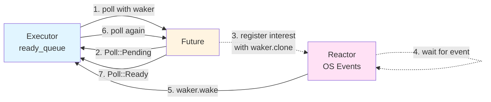

# Async Rust

## 1. Introduction to Asynchronous Programming

Asynchronous programming allows a program to handle multiple tasks concurrently without blocking. Instead of waiting idle for an operation (like reading from a file or network) to complete, the program can switch to other tasks and return to the original one when it's ready to make progress.

### 1.1 Blocking vs Non-Blocking

```cpp
// Blocking - thread waits idle for I/O
std::string data = read_file("input.txt");  // Thread blocks here
process(data);
```

```cpp
// Non-Blocking - thread can do other work while waiting
read_file_async("input.txt", callback);  // Returns immediately
// Thread can do other work while I/O happens
```

### 1.2 Asynchronous Programming in C++

C++ handles asynchronous operations primarily through two patterns:

**1. Callbacks** - Pass a function to be called when the operation completes:

```cpp
read_file_async("input.txt", [](std::string data) {
    process_async(data, [](Result result) {
        write_file_async("output.txt", result, [](bool success) {
            // Callback hell!
        });
    });
});
```

**2. Promises/Futures** - Return a handle to a future value:

```cpp
std::future<std::string> future = std::async(std::launch::async, read_file, "input.txt");
// Do other work...
std::string data = future.get();  // Blocks until ready
process(data);
```

### 1.3 Rust's Async/Await - A Better Way

Rust's async/await syntax provides the efficiency of non-blocking I/O with the readability of synchronous code:

```rust
async fn process_file() -> std::io::Result<()> {
    let data = read_file("input.txt").await?;
    let result = process(data).await?;
    write_file("output.txt", result).await?;
    Ok(())
}
```

### 1.4 Asynchronous vs Concurrent Execution

There's an important distinction to understand:

**Asynchronous** means non-blocking - a single task can pause and resume without blocking the thread. This is what `async/await` gives us.

**Concurrent** means multiple tasks making progress during overlapping time periods - they don't have to start or finish at the same time, but they're all in-progress together.

Consider these two approaches:

```rust
// Sequential: Tasks run one after another (takes 4 seconds total)
async fn sequential() {
    task_a().await;  // 2 seconds
    task_b().await;  // 2 seconds
}

// Concurrent: Tasks run at the same time (takes 2 seconds total)
async fn concurrent() {
    tokio::join!(task_a(), task_b());  // Both run simultaneously
}
```

In the sequential version, even though each function is asynchronous (non-blocking), they still run one after another because we `.await` each one before starting the next.

In the concurrent version, `tokio::join!` starts both tasks and runs them concurrently. While `task_a` is waiting for I/O, `task_b` can make progress, and vice versa. The macro waits for both to complete before returning.

**Key insight**: `async/await` enables asynchronous execution, but you need constructs like `tokio::join!`, `tokio::spawn`, or `futures::join!` to achieve concurrent execution of multiple async tasks.

A code example demonstrating concurrent execution of async functions using `tokio::join!` can be found in the [`intro/`](intro/) directory.

## 2. Futures

Now that we understand why Rust's async/await is better than callbacks or blocking operations, let's dive into how it actually works.

The `async fn process_file() -> std::io::Result<()>` is actually just syntactic sugar and desugars to something like:

```rust

fn process_file() -> impl std::future::Future<Output = std::io::Result<()>> {
    async{
        let data = read_file("input.txt").await?;
        let result = process(data).await?;
        write_file("output.txt", result).await?;
        Ok(())
    }
}
```

Basically a normal Rust function that returns something that implements `std::future::Future<Output = std::io::Result<()>>`. And when we look into the function body we can see what this actually is... A code block wrapped with the `async` keyword.
But let's get back to this later and look at the return type first...

### 2.1 The Future trait

What the standard library gives us is the `Future` trait.
All Futures have to implement this trait by defining an `Output` type and implementing `poll`:

```rust
pub enum Poll<T> {
    Ready(T),
    Pending,
}
pub trait Future {
    // The output type represents the type of a value that will be returned in the future.
    type Output;
    // When polled the Future either returns `Poll::Ready(T)`, when it is done
    // or `Poll::Pending`, which means that it will have to be polled again to
    // eventually return the promised value.
    // `poll` should NEVER block and return immediately!!!
    fn poll(self: Pin<&mut Self>, cx: &mut Context<'_>) -> Poll<Self::Output>;
}
```

> Notice the `Pin<&mut Self>` we explain why this is necessary in section 6.

When the Future is `await`ed, the runtime calls `poll` on it for the first time.
Rust Futures are lazy and don't do anything before the first call to `poll`.

### 2.2 Non-Leaf Futures

**Non-leaf futures** are the futures that you write as a user of an async runtime. They are pausable/resumable functions that:

- Start with the `async` keyword
- `await` other futures
- Can be paused at any `.await` point

The compiler transforms the body of our `async` function into a state machine implementing the `Future` trait.

When such a state machine is polled, it progresses until it reaches a so called **leaf future** which actually `.await`s for some I/O operation and returns `Poll::Pending`. At that point, the non-leaf future also returns `Poll::Pending`.
When woken up and polled again, it continues from where it left off, polls the leaf future again this time it returns `Poll::Ready` and the non-leaf future can progress to its next `await` point. Eventually the non-leaf future reaches its end and returns `Poll::Ready(T)`.

### 2.3 Leaf Futures

**Leaf futures** are the opposite - they're provided by the runtime and represent actual I/O operations:

- Perform I/O in a non-blocking way (file reads, network calls, timers)
- Leverage operating system and hardware support (interrupts, epoll, kqueue)
- Called by non-leaf futures - they're the actual await points
- When returning `Poll::Pending`, they register a waker to be notified when the operation completes

### 2.4 Summary

**Key distinction**: Non-leaf futures are your `async` functions. Leaf futures are what makes `.await` actually wait for something.

```rust
// Non-leaf future
async fn process_file() -> std::io::Result<()> {
    let contents = tokio::fs::read("input.txt").await?; // Leaf future
    tokio::fs::write("output.txt", contents.to_ascii_uppercase()).await?; // Leaf future
    Ok(())
}
```

## 3. Implementing our own leaf future an AsyncTimer

A code example demonstrating a naive implementation of an async timer with busy polling can be found in the [`naive_async_timer/`](naive_async_timer/) directory.

A code example demonstrating a more elaborate but still academic implementation of an async timer using a the `Waker` from the `Context` can be found in the [`async_timer/`](async_timer/) directory.

## 4. What does the compiler do with our `async fn`

We've seen that non-leaf futures are pausable/resumable functions written with `async` and `await`. But how does Rust actually implement this magic? How can a function pause in the middle and resume later?

The answer: **The compiler transforms async functions into state machines.**

Or more correctly the `async` block that is returned from the desugared function is transformed...

```rust
fn coroutine() -> impl std::future::Future<Output = usize> {
    async{
        /// Start
        /// ---------------------------------------------
        let mut i = 5;
        tokio::time::sleep(Duration::from_secs(2)).await;
        /// Wait1
        /// ---------------------------------------------
        println!("i is {i}");
        i += 3;
        tokio::time::sleep(Duration::from_secs(2)).await;
        /// Wait2
        /// ---------------------------------------------
        println!("i is {i}");
        i
        /// Resolved
    }
}
```

...into a state machine that implements the `Future` trait:

```rust
fn coroutine_transformed() -> impl std::future::Future<Output = usize> {
    enum CoroutineState {
        Start,
        Wait1(Pin<Box<dyn Future<Output = ()>>>),
        Wait2(Pin<Box<dyn Future<Output = ()>>>),
        Resolved,
    }

    struct Coroutine {
        state: CoroutineState,
        i: usize,
    }

    impl Future for Coroutine {
        type Output = usize;

        fn poll(
            mut self: std::pin::Pin<&mut Self>,
            cx: &mut std::task::Context<'_>,
        ) -> std::task::Poll<Self::Output> {
            loop {
                match &mut self.state {
                    CoroutineState::Start => {
                        //---------------------------
                        self.i = 5;
                        self.state =
                            CoroutineState::Wait1(Box::pin(tokio::time::sleep(Duration::from_secs(2))));
                        continue;
                    }
                    CoroutineState::Wait1(future) => match pin!(future).poll(cx) {
                        // ----------------------------
                        Poll::Pending => return Poll::Pending,
                        Poll::Ready(()) => {
                            println!("i is {}", self.i);
                            self.i += 3;
                            self.state = CoroutineState::Wait2(Box::pin(tokio::time::sleep(
                                Duration::from_secs(2),
                            )));
                            continue;
                        }
                    },
                    CoroutineState::Wait2(future) => match pin!(future).poll(cx) {
                        //--------------------------------
                        Poll::Pending => return Poll::Pending,
                        Poll::Ready(()) => {
                            self.state = CoroutineState::Resolved;
                            println!("i is {}", self.i);
                            return Poll::Ready(self.i);
                        //---------------------------------
                        }
                    },
                    CoroutineState::Resolved => panic!("Future already resolved"),
                }
            }
        }
    }
    Coroutine{
        state: CoroutineState::Start,
        i: 0,
    }
}
```

Code examples for this section can be found in the [`coroutines/`](coroutines/) directory. Run `cargo run --bin coroutines` to see the demonstration of how tokio drives our handcrafted coroutine to completion.

## 5. The Runtime

So far we've seen:

- **Futures** that return `Poll::Pending` or `Poll::Ready`
- **Wakers** that notify when a future is ready to progress
- **State machines** that the compiler generates

But who actually **polls** these futures? Who **manages** multiple futures running concurrently? That's the job of the **runtime**. Let's see what the tokio runtime does.

### 5.1 Expanding `tokio::main`

When we expand following `tokio::main`...

```rust
#[tokio::main]
async fn main() {
    process_file().await.unwrap();
    another_async_fn().await;
}
```

...we get:

```rust
fn main() {
    let body = async {
        process_file().await.unwrap();
        another_async_fn().await;
    };
    {
        return tokio::runtime::Builder::new_multi_thread()
            .enable_all()
            .build()
            .expect("Failed building the Runtime")
            .block_on(body);
    }
}
```

Remember, that the `async { ... }` block is transformed into a state machine by the compiler and this state machine is driven by the runtime, when `block_on` is called.

## 6 Implementing our own Runtime

A runtime consists of two main components:

1. **Executor**: Schedules and polls futures, managing which ones are ready to make progress
2. **Reactor**: Efficiently waits for OS events (I/O, timers) and wakes the executor when futures can continue

Here's how they work together:



**The flow:**

1. Executor polls future, passing a waker
2. Future returns `Poll::Pending` and stores the waker
3. Future registers interest with reactor using `waker.clone()` (e.g., for a timer or I/O)
4. Reactor efficiently waits for the OS event
5. When event occurs, reactor calls `waker.wake()` to notify executor
6. Executor polls the future again
7. Future returns `Poll::Ready(T)` - done!

In this chapter, we'll focus on building a **minimal executor** to understand how futures are driven to completion. We'll skip the reactor (which would use epoll/kqueue) and rely on our simple thread-based timers.

### 6.1 The Executor's Job

The executor needs to:

1. **Schedule tasks**: Store futures and give each one a unique ID
2. **Track readiness**: Keep a queue of task IDs that are ready to be polled
3. **Poll loop**: Continuously poll ready tasks until all complete
4. **Handle wakers**: When a future returns `Poll::Pending`, it must accept waker callbacks to know when to poll again
5. **Efficient waiting**: When no tasks are ready, park the thread instead of busy-polling

### 6.2 Implementation Overview

Our minimal executor uses:

- `HashMap<usize, Task>`: Stores all scheduled futures by their ID
- `VecDeque<usize>`: Queue of task IDs that are ready to be polled
- Custom `Waker`: Contains the task ID and ready queue reference, so it can re-schedule tasks

**Key insight**: When a future returns `Poll::Pending`, we give it a waker. When that waker's `wake()` method is called (by our timer thread), it pushes the task ID back onto the ready queue and unparks the executor thread.

### 6.3 The Executor Loop

```text
1. Pop a task ID from ready_queue
2. Remove the future from the tasks HashMap
3. Create a waker with this task's ID
4. Poll the future with the waker
5. If Poll::Pending → put future back in HashMap (waker will re-queue it)
6. If Poll::Ready → task complete, don't store it again
7. If ready_queue is empty but tasks remain → park thread (wait for wakers)
8. If no tasks remain → done!
```

When `thread::park()` is called, the executor gives control back to the OS. The thread will wake up when any waker calls `thread::unpark()` - this is how we avoid busy-polling while waiting for events.

Code examples for this section can be found in the [`runtime/`](runtime/) directory. Run `cargo run --bin runtime` to see a demonstration of an executor scheduling futures to be polled concurrently.

## 7. Pinning and Self-Referential Structs

### 7.1 Self-Referential Structs

Because of Rust's explicit ownership system, there is no way to create self referential structs in safe Rust and code like this won't compile:

```rust
struct SelfRef<'a>{
    data: String,
    reference: Option<&'a String>,
}

impl<'a> SelfRef<'a> {
    fn new(data: String) -> Self {
        SelfRef {
            data,
            reference: None,
        }
    }
    fn init(&mut self) {
        self.reference = Some(&self.data);
    }
}
```

To implement something like this, we need to use raw pointers:

```rust
pub struct SelfRef {
    data: String,
    reference: *const String,
}

impl SelfRef {
    pub fn new(data: String) -> Self {
        SelfRef {
            data,
            reference: std::ptr::null(),
        }
    }
    pub fn init(&mut self) {
        self.reference = &self.data as *const String;
    }
}
```

And to dereference the pointers we now actually have to write unsafe code, because there is no way the compiler can guarantee, that the pointer is still valid. For example after a move (a bitwise copy in Rust) the pointer would be invalidated.

### 7.2 Pinning to the rescue

To prevent such moves and to guarantee, that the object won't be moved and won't change its memory location in Rust we can pin it by wrapping the type in a `std::pin::Pin`. A pinned value cannot be moved and won't change its memory location, the compiler will prevent this.
However, a pinned value can be unpinned in safe Rust, as long as it implements `Unpin`.
Most types in Rust implement `Unpin` by default and can therefore be unpinned and moved again.
But async functions Do NOT implement `Unpin` (they implement `!Unpin`).

If you want your type to implement `!Unpin` you can only do so by using `!Unpin` type like `PhantomPinned` in your structures, as you cannot implement negative traits.

So a safe implementation of our struct would be:

```rust
pub struct SelfRef {
    data: String,
    reference: *const String,
    _pin: std::marker::PhantomPinned,
}

impl Display for SelfRef {
    fn fmt(&self, f: &mut std::fmt::Formatter<'_>) -> std::fmt::Result {
        if self.reference.is_null() {
            return write!(f, "data: {}, reference: null", self.data);
        }
        unsafe { write!(f, "data: {}, reference: {}", self.data, *self.reference) }
    }
}

impl SelfRef {
    pub fn new(data: String) -> Self {
        SelfRef {
            data,
            reference: std::ptr::null(),
            _pin: std::marker::PhantomPinned,
        }
    }
    pub fn init(mut self: std::pin::Pin<&mut Self>) {
        unsafe {
            let this = self.as_mut().get_unchecked_mut();
            this.reference = &this.data as *const String;
        }
    }
}
```

Code examples for this section can be found in the [`self_ref/`](self_ref/) directory. Run `cargo run --bin self_ref` to see demonstrations of:

- Unpinned self-referential structs (shows the bug when moved after initialization)
- Pinned but `Unpin` structs (can still be unpinned with `Pin::into_inner()`)
- Pinned `!Unpin` structs with `PhantomPinned` (requires `unsafe` and `Pin::into_inner_unchecked()` to unpin)

> Key takeaway: A pinned value cannot be moved. A pinned value CANNOT be unpinned again in safe Rust, unless it implements `Unpin`.

## 8. Why we have to pass `Pin<&mut Self>` to poll

To support all types of async functions, even those that contain self references, ALL async functions are marked as `!Unpin` by the compiler.

This means before the first poll we can safely move the async function around, as no self references could have been initialized.
But at the first poll, we need to pin it to assure the compiler, that no self references, that could have been established on the first poll, could potentially be invalidated by moving the async function afterwards.
Unpinning an async function after the first poll can NOT be done in safe rust, because they DO NOT implement `Unpin`.

A code example for this section can be found in the [`pin/`](pin/) directory.
