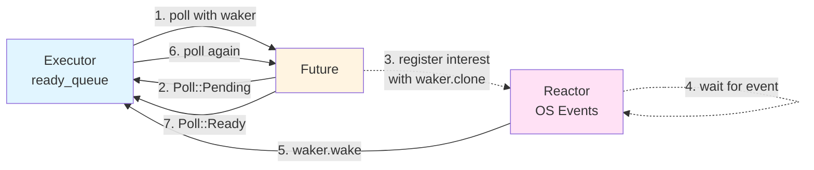

```mermaid
flowchart LR
    E[Executor<br/>ready_queue]
    F[Future]
    R[Reactor<br/>OS Events]

    E -->|1. poll with waker| F
    F -->|2. Poll::Pending<br/>| E
    F -.->|3. register interest<br/>with waker.clone| R
    R -.->|4. wait for event| R
    R -->|5. waker.wake| E
    E -->|6. poll again| F
    F -->|7. Poll::Ready| E

    style E fill:#e1f5ff
    style F fill:#fff4e1
    style R fill:#ffe1f5
```
